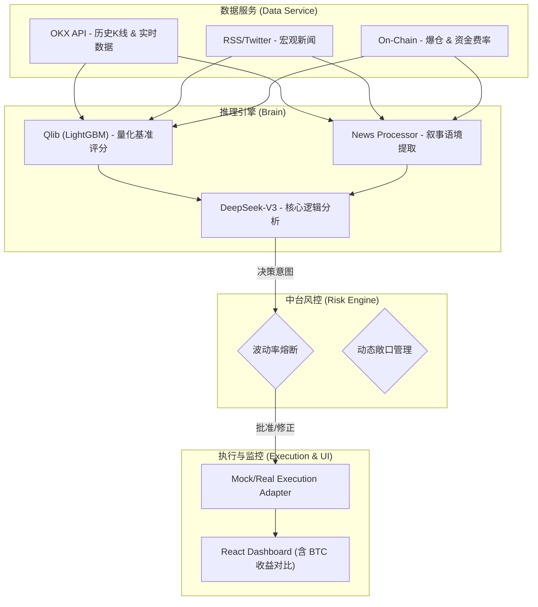

# Data - 机构级 AI 交易基础设施 产品 Wiki

> **项目定位**: 一套将非结构化市场数据标准化、通过 AI 进行逻辑推理并实现自动化执行的交易系统。
> **核心架构**: Neuro-Symbolic 架构（Qlib 量化计算 + LLM 叙事推理）。

---

## 🚀 1. 项目概述

Data 是一个自主运行的 AI 交易代理，专为加密货币市场设计。它不仅依赖传统的技术指标，还通过大语言模型（LLM）理解宏观叙事和市场微观结构。

### 1.1 核心价值
- **决策科学化**: 告别主观判断，所有交易均基于量化评分和 AI 逻辑推理。
- **风险前置**: 内置三层中台风控引擎，在执行前拦截高风险指令。
- **透明度**: 实时生成中英文对照的决策日志，解释“为什么买”和“失效条件”。

---

## 🏗️ 2. 技术架构

系统采用模块化设计，解耦了数据、推理、风控和执行四个核心层次。



---

## 🧩 3. 核心模块详情

### 3.1 推理引擎与提示词策略 (DeepSeek_Agent.py)
这是系统的“大脑”，其核心在于**提示词工程 (Prompt Engineering)**。
- **系统提示词 (System Prompt)**：定义了 AI 作为“Data”的角色，包含：
    - **叙事校验 (Narrative vs Reality)**：判断价格走势是否已消化新闻。
    - **痛苦交易 (Pain Trade)**：利用资金费率和清算数据寻找挤压机会。
    - **剧本菜单 (Hypothesis Menu)**：强制 AI 提供“趋势跟踪”、“均值回归”和“微观结构挤压”三种情景分析。
- **输出规范**：强制 JSON 输出，包含中英文双语分析，便于前端直接渲染。

### 3.2 新闻与叙事处理流 (News Processing Flow)
系统通过 `fetch_onchain_and_news.py` 实现非结构化数据的结构化：
1.  **多源聚合**：通过 RSS (Feedburner, Cointelegraph) 和 CryptoCompare API 获取新闻。
2.  **上下文提炼**：
    -   **48h 清算统计**：计算多空爆仓比例，超 2 倍则触发反弹/回调预警。
    -   **经济日历对接**：锁定 CPI、非农等宏观节点。
    -   **情绪参数**：整合 Fear & Greed 指数。
3.  **降噪处理**：为防止 LLM 被噪音淹没，仅提取标题和核心摘要，并按币种分类。

### 3.3 中台风控系统 (Risk Engine)
作为交易的“守门员”，风控引擎在代码层级强制执行：
- **杠杆范围控制**: 严格限制杠杆在 **1x - 5x** 之间。
- **波动率守护 (Volatility Guard)**: 当检测到高波动环境（ATR 异常）时，强制将杠杆降至 **1x**。
- **熊市保护模式**: 若价格低于 SMA50 或处于极端恐惧（F&G < 40），总敞口限制在 50% NAV 以内。

### 3.6 收益率对比可视化 (Yield Comparison)
仪表盘包含实时的**收益率对比模块**：
- **Strategy vs BTC**: 将策略的净值曲线与比特币价格走势叠加展示。
- **相对超额收益**: 自动计算并显示策略收益率与 BTC 涨跌幅的差值，直观体现 AI 策略的 Alpha（超额收益）获取能力。

### 3.4 执行引擎与模拟交易 (Execution & Paper Trade)
系统通过 `mock_trade_executor.py` 实现**零成本验证**（Paper Trading）：
1.  **状态机模型**：执行器读取 `agent_decision_log.json` 中的“意图”，并对照 `portfolio_state.json` 中的当前仓位。
2.  **订单合并逻辑 (Order Merging)**：
    -   系统会自动检测已存在的同标的持仓。
    -   新开仓指令若涉及已有币种，系统将执行“加仓合并”，自动计算**加权平均入场价**，而非展示为多笔孤立订单，确保账户整洁且盈亏计算准确。
3.  **撮合逻辑**：
    -   **市价模拟**：使用 4 小时线的收盘价作为成交价。
    -   **内插 TP/SL 检查**：利用 K 线的高低点 (High/Low) 模拟盘中触发止损或止盈的情况。
    -   **佣金与损耗**：默认设置 0.1% 的 Taker 手续费，确保回测收益具有实战参考价值。
3.  **实盘切换**：架构设计已解耦。若需切换实盘，只需替换执行适配器（Adapter），将 JSON 修改逻辑改为调用交易所 API（如 CCXT 库），而无需变动“大脑”和“风控”模块。

### 3.5 数据 Schema (Data Schemas)
为了确保系统可复刻，以下是核心文件的结构定义：

- **portfolio_state.json**:
    ```json
    {
      "nav": 10500.0,
      "cash": 8500.0,
      "positions": [
        {
          "symbol": "BTC",
          "side": "long",
          "quantity": 0.01,
          "entry_price": 95000,
          "leverage": 2.0,
          "exit_plan": { "stop_loss": 92000, "take_profit": 100000 }
        }
      ]
    }
    ```
- **市场数据 (CSV)**: 必须包含 `date`, `datetime`, `open`, `high`, `low`, `close`, `volume` 等列。

### 3.5 决策逻辑伪代码 (Logic Pseudo-code)
```python
1. 获取 Qlib Ranking (基于过去 60 天特征)
2. 提取新闻情绪 (使用 DeepSeek 提取宏观关键词)
3. 检查风控限制:
   - IF BTC < SMA50: Max_Exposure = 50%
   - IF ATR > Threshold: Leverage = 1x
4. 生成交易指令:
   - Rank 1 + 利好 + 费率低 = 开多
   - 现仓利润触及 TP/SL = 平仓
```

---

## 📡 4. 接口文档 (API Reference)

后端基于 Flask 提供服务，主要接口如下：

| 接口路径 | 方法 | 说明 | 返回示例 |
| :--- | :--- | :--- | :--- |
| `/api/agent-decision` | GET | 获取 AI 最新的决策日志和分析过程 | `{ "analysis_summary": {...}, "actions": [...] }` |
| `/api/positions` | GET | 获取当前账户的持仓状态、盈亏和杠杆 | `[ { "symbol": "BTC", "pnlPercent": 5.2, ... } ]` |
| `/api/summary` | GET | 总览净值 (NAV)、总盈亏、运行天数、及 BTC 对比收益率 | `{ "nav": 10500, "btcReturn": 0.05, ... }` |
| `/api/history` | GET | 历史交易记录及收益归因 | `[ { "exitPrice": 98000, "realizedPnl": 120, ... } ]` |
| `/api/nav-history` | GET | 获取净值历史曲线数据 | `[ { "timestamp": "...", "nav": 10200 }, ... ]` |

---

## ⚙️ 5. 部署与维护

### 5.1 环境要求
- Python 3.9+
- Node.js 18+ (用于前端)
- 依赖项: Qlib, LightGBM, Flask, Pandas, OpenAI SDK (DeepSeek API)。

### 5.2 启动步骤
1. **安装后端依赖**: `pip install -r requirements.txt`
2. **配置环境变量**: 编辑 `.env` 文件，填入 `DEEPSEEK_API_KEY` 和交易所 API 密钥。
3. **启动后端服务器**: `python server.py`
4. **启动定时任务**: `python scheduler.py` (循环执行 `run_daily_cycle.py`)。
5. **启动前端**: `cd frontpages && npm run dev`。

---

## 📈 6. 核心配置文件说明

- `portfolio_state.json`: **核心账本**。存储当前 NAV、可用余额及已成交的仓位。
- `agent_decision_log.json`: **决策历史**。前台看板“模型决策”栏目的数据源。
- `nav_history.csv`: **收益数据**。每小时/每日记录一次净值，用于绘制收益曲线。

---

### 6.2 数据流转与同步 (Data Flow & Sync)
为了保持分布式部署（如 Railway + GitHub Pages）的一致性，系统采用以下流向：
1.  **本地/服务器执行**: `scheduler.py` 每 4 小时触发一次 `run_daily_cycle.py`。
2.  **文件更新**: 生成最新的 `.json` 和 `.csv` 账本文件。
3.  **前端同步**: `scheduler.py` 自动将这些文件拷贝至 `frontpages/public/data/` 目录。
4.  **远程备份**: 自动执行 `git push`（若配置了 `GITHUB_TOKEN`），确保云端数据实时更新。

---

## ⚠️ 开发者注意事项
- **Qlib 编译**: 在某些环境下，Qlib 需要从源码编译并手动指定其数据目录。
- **配置优先级**: `.env` 中的 `HTTP_PROXY` 对数据抓取模块生效，若网络受限必须配置。
- **DeepSeek 延迟**: 生成式推理可能耗时 30s-120s，已接入 120s 超时保护。
